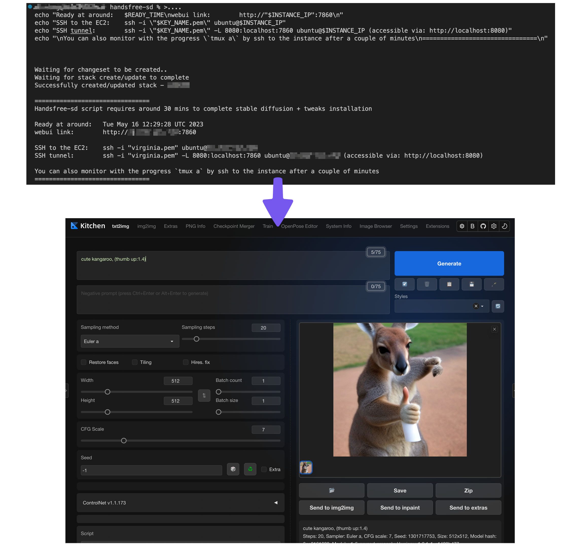
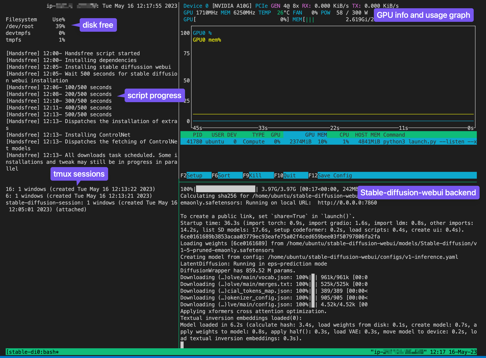

# Handsfree-stable-diffusion for EC2 G5 isntances


Handsfree-stable-diffusion is a CloudFormation template+script for deploying Stable Diffusion webui - fully hands free.

I originally created this script because my ancient 2014 laptop is impossible to run stable-diffusion in any meaningful way. This script enable me to explore stable diffusion and keep the cost very low by deploying and removing all the resources anytime via the magic of CloudFormation stack.

I believe by open sourcing this template+script, it can benefit some of you brothers and sisters who are stuck with old laptops but love to explore stable diffusion.

For those who already have `awscli` configure, it is as easy as `copy and paste` the script, runs it and enjoy a coffee until the installation is completed

This script automates the prerequisites (resources, networking, driver for GPU, Python version), then installs sd-webui based on the amazing work of [`AUTOMATIC1111`](https://github.com/AUTOMATIC1111/stable-diffusion-webui), along with tweaks that can help getting started with stable diffusion.

This Cloudformation template+script is developed on [`G5 instance`](https://aws.amazon.com/ec2/instance-types/g5/) with `Deep Learning AMI GPU PyTorch 2.0.0 (Ubuntu 20.04) 20230401` at `us-east-1` region. If other regions are used, ensure G5 is available in the region and change to an equivalent AMI id for that particular region.

All technical detail is available in the [Features section](#Features)

### Why this script?
- Instance configuration to find the right GPU, AMI and driver can be a lengthly process, the right combination is ready in the template+script
- Installing dependencies often requires one to babysit the CLI, the script fully automates the process
- Deployment can be done by CLI or web console

### Prerequisites
- An AWS account
- `awscli` installed and configured, see [official docs here](https://aws.amazon.com/cli/) 
- A key pair for EC2, i.e `keypair.pem`
- basic knowledge on AWS EC2/CFN helps, but not required

# Installation (CLI)
## 1. Download the template file
```
curl -o handsfree-sd-g5.yml https://raw.githubusercontent.com/MarcoLeongDev/handsfree-stable-diffusion/main/handsfree-sd-g5.yml
```
## 2. Copy and edit the following shell command
Changes needed:
- `my-stack-name`: to a preferred name. This name is what you are going to see on CloudFormation console and to be referred to in awscli
- `keypair`: to the name of your key pair. e.g. `mykey.pem` should be `mykey`, without the `.pem` extension name. If you need help understanding keypair, [see the doc here](https://docs.aws.amazon.com/AWSEC2/latest/UserGuide/ec2-key-pairs.html)

### MacOS CLI
```
STACK_NAME="my-stack-name"
KEY_NAME="keypair"
aws cloudformation deploy --template-file handsfree-sd-g5.yml --parameter-overrides "KeyName=$KEY_NAME"  --region us-east-1 --stack-name $STACK_NAME
READY_TIME=`date -u -v+30M`
INSTANCE_IP=`aws cloudformation describe-stacks --region us-east-1 --query 'Stacks[0].Outputs[0].OutputValue' --output text --stack-name $STACK_NAME` 
echo "\nHandsfree-sd script requires around 30 mins to complete stable diffusion + tweaks installation\n"
echo "Ready at around:   $READY_TIME"
echo "webui link:        http://"$INSTANCE_IP":7860"
echo "SSH to the EC2:    ssh -i \"$KEY_NAME.pem\" ubuntu@$INSTANCE_IP"
echo "\nYou can also monitor with the progress \`tmux a\` by ssh to the instance after a couple of minutes\n"
```
\* [to relaunch the webui in the backend](#e-relaunch-the-tmux-dash)

### Linux/Unix CLI
```
STACK_NAME="my-stack-name"
KEY_NAME="keypair"
aws cloudformation deploy --template-file handsfree-sd-g5.yml --parameter-overrides "KeyName=$KEY_NAME"  --region us-east-1 --stack-name $STACK_NAME
READY_TIME=`date -u --date="+30 minutes"`
INSTANCE_IP=`aws cloudformation describe-stacks --region us-east-1 --query 'Stacks[0].Outputs[0].OutputValue' --output text --stack-name $STACK_NAME` 
echo "\nHandsfree-sd script requires around 30 mins to complete stable diffusion + tweaks installation\n"
echo "Ready at around:   $READY_TIME"
echo "webui link:        http://"$INSTANCE_IP":7860"
echo "SSH to the EC2:    ssh -i \"$KEY_NAME.pem\" ubuntu@$INSTANCE_IP"
echo "\nYou can also monitor with the progress \`tmux a\` by ssh to the instance after a couple of minutes\n"
```
\* [to relaunch the webui in the backend](#e-relaunch-the-tmux-dash)

### Windows Command Prompt / Powershell
```
To Windows Gurus, would you kindly provide some the equivalent for Command Prompt / Powershell?
```

## 3. CLI Output

The script was designed to execute command with parallelism, except for a few dependent steps. After everything is scheduled, it reports back with a some key info. for SSH and browser access
```
Waiting for changeset to be created.
Waiting for stack create/update to complete
Successfully created/updated stack - your-stack-name

================================
Handsfree-sd script requires around 30 mins to complete stable diffusion + tweaks installation

Ready at around:   Tue May 16 06:35:47 UTC 2023
webui link:        http://▒▒.▒▒.▒▒.▒▒:7860
SSH to the EC2:    ssh -i "keypair.pem" ubuntu@▒▒.▒▒.▒▒.▒▒

You can also monitor with the progress `tmux a` by ssh to the instance after a couple of minutes
================================
```
- `Ready at around`: an estimated time when the installation is ready
- `webui link`: the url for your browser once the installation is completed
- `SSH to the EC2`: sample code for SSH to the EC2. Optional yet recommended to gain more insights

## 4. Activate the tweaks
Enter the url in a browser, http://▒▒.▒▒.▒▒.▒▒:7869 with the IP from the previous step, the default webui should be displayed:


To active the extenions, click `Extension` → `Apply and restart UI`


After a few seconds, all the tweaks and the new UI should be ready


# Managing the EC2 (CLI)

## Monitor the backend from CLI

Stable-diffusion is by design still quite backend heavy. The script is designed to use `tmux` to create a dash experience with `df`, `nvtop` and `webui`, which runs in the background. To show this dashboard, attach the session by entering:

```
tmux a
```
the following should be displayed



## Using the tmux dashboard

`tmux` is very powerful and to master it is beyond the scope for this page. If you like to learn more see [tmux cheatsheet](https://tmuxcheatsheet.com/) 

To get started, here are a few common use cases pertain to this script. The key concept is tmux listen to `Ctrl-b` for command activation

### A. Detach from the session, keeps thing running in the background
- Press `Ctrl-b`, then press `d` to detach
- It is safe to use the command line or even `exit` from the instance, things will still be running in the background

### B. Attach to the running session when connect to the command line
- ssh to the instance, then `$ tmux a`
- it should display the tmux dash again

### C. Shifting focus to panel in tmux
- Press `Ctrl-b`, then press the corresponding arrow keys `▲ ▼ ▶ ◀` to shift focus to a panel

### D. Terminate the webui / nvtop / custom script
- For the focused panel, `Ctrl+c` to stop the executing; do it three times to end all three panel if needed
- webui can freeze once in a while, this technique help to reset things

### E. Relaunch the tmux dash
- `copy and paste` the following
```
cd ~; sudo -u ubuntu tmux new-session -s "stable-diffusion-session" watch "df -h --output=source,pcent | head -4; echo ""; cat progress.log; echo "";  tmux list-sessions" \;  split-window -h -p 75 nvtop\; split-window -v "bash stable-diffusion-webui/webui.sh --listen --xformers --enable-insecure-extension-access --skip-torch-cuda-test; read" \;
```
- What it does: 
  - **creates a tmux session**: for parallel and background processing
  - **shows the disk free %**: space left for model and creation
  - **display handfree-sd script progress**: monitor the progress during installation
  - **list all the tmux session**: monitor the progress of parallel installations of extensions and tweaks

# Uninstall (CLI)

**⚠️ Caution the following instruction wipe the installation ⚠️**

### MacO / Linux / Unix CLI

```
aws cloudformation delete-stack --region us-east-1 --stack-name "my-stack-name"
```
### Windows Command Prompt / Powershell
```
To Windows Gurus, would you kindly provide some the equivalent for Command Prompt / Powershell?
```

# Installation (AWS Web console)

## 1. Navigate to CloudFormation


## 2. Create a new stack


## 3. Choose the template yml file


## 4. Fill in the information
- `Stack Name`: to a preferred name. This name is what you are going to see on CloudFormation console and to be referred to in awscli
- `AmiId`: default is fine for us-east-1 region
- `DriveSize`: determine the disk space, this script with OS + stable diffusion + tweaks uses around 36% of the 200 GB default
- `InstanceType`: default to `g5.xlarge` for exploration. Any G5 instance works correctly
- `Keyname`: to the name of your key pair. e.g. mykey.pem should be mykey, without the .pem extension name


## 5. Keep the default for this page


## 6. Confirm to deploy

## 7. Created stack
- After the stack is created, the progress can be seen in the `Event` tab


## 8. Completion of deploy
- Once the deployment of resource is completed. The ip address would be displayed in the `Output` tab
- Notice that the script will still be installing stable diffussion and tweaks in the background
- It takes around 30 mins for the whole process to completed the `g5.xlarge`, the higher specs should complete the process quicker


## 9. Activate the tweaks
Enter the url in a browser, http://▒▒.▒▒.▒▒.▒▒:7869 with the IP from the previous step, it should show the default UI


To active the extenions, click `Extension` → `Apply and restart UI`


After a few seconds, all the tweaks and the new UI should be ready


## 10. Managing the EC2
As stable diffusion is still backend heavy. The many interaction can only be achieve in command line, see the [Managing the EC2 (CLI) section](#managing-the-ec2-cli) more information

# Technical specifications
### What it does
- Launch an Ubuntu EC2 with [Nvidia A10G GPU](https://d1.awsstatic.com/product-marketing/ec2/NVIDIA_AWS_A10G_DataSheet_FINAL_02_17_2022.pdf) via CloudFormation
- Create an Elastic IP and attach to the EC2, this allows the EC2 to always use the same IP
- Installations
  - The prerequisites for stable diffusion webui
  - Stable diffusion webui (Automatic1111)
  - Installs tweaks (by default, but optional, [see the Tweaks section](#Tweaks))
- Launches Stable diffusion and `nvtop` with `tmux` for backend monitoring

### Resources
- Ubuntu EC2 with [Nvidia A10G GPU](https://d1.awsstatic.com/product-marketing/ec2/NVIDIA_AWS_A10G_DataSheet_FINAL_02_17_2022.pdf): an EC2 can be stopped to stop paying for the running time. The EBS volume (hdd/ssd) will still be change but cost is small compare to the cost of running the G5 instance
- Security Group: think of it as firewall rules in AWS, free
- Elastic IP: free when attached to a running instance, small cost when not attached to anything

### Tweaks include
```
Lora       add_detail
Model      stable-diffusion-v2-1
VAE        EMA and MSE for fixing face/eyes
embeddings ng_deepnegative, verybadimagenegative, easynegative, badhand
Tools      ControlNet, openpose
Info       system info, images-browser
Theme      kitchen-theme
Safety     nsfw-censor (remove for the adventurous)
```

### Notable programs include
- tmux: to allow parallel and acts as dashboard for the backend
- nvtop: to monitor GPU and CPU memory and % usage

# Pricing
At the time of writing (29th May 2023), the smallest instance type `g5.xlarge` (1 CPU, 4 vCPU, 24GB GPU memory, 16GB RAM) cost $1.006 in us-east-1. Refer to the [most updated pricing info here](https://aws.amazon.com/ec2/instance-types/g5/#Product_details). For my exploration, I never have to using anything above `g5.xlarge`, `approx $1/hr` is decently affordable for exploration and hobbiest. 

The `minimum is 24GB` GPU memory and the `maximum is 768GB` GPU, so it is suitable for hobbyist, also to run massive project and anything in between!

# FAQ
1. How do I skip the tweaks and just use the Cloudformation template and install stable diffusion webui?
- Change `INSTALL_TWEAKS=true` to `INSTALL_TWEAKS=false` in the template/script. The install would be the vanilla version from Automatic1111

2. I see AGPL license, can I use the code for my business?
- Best is to consult a lawyer. My understanding is, AGPL means all your related source code will also have to be open source under AGPL as well. If that's your business model, guess it is .... fine?

3. Can I use the creation of stable diffusion for my business?
- My understanding is the authorship is defined differently in different jurisdictions. Again, ask your lawyer to ensure it is okay

4. Y CFN? Y U no terraform?
- I am more familiar with Cloudformation. If you can help me with terraform, you are absolutely welcome.

5. Why are you choosing the template+script approach?
- I believe CFN template with user data script is a clearer solution as everything is self-contained in one single file. I could have move the bash script external and fetch+execute with user data, but I found this approach make the script invisible to the end user. So it is more about balance the pros and cons

6. The reason for using G5?
- G5 is the latest offering from AWS, it is way cheaper and more power compare to previous instance type (g4dn, g3, etc)

7. Are you really from Australia?
- Yes and no, no one is really from Australia except the indigious people whom we learnt to respect more than the history did. But yes, I live here in beautiful Sydney. You should get your ass here and drink beer with us

8. I like ugly kangaroo, can I have more?
- They aren't ugly but here the full resolution and one extra:


9. Are you a prompt-engineer only for questionable kangaroos? 
- I was luck to have other humble creations: https://pixai.art/@marcoleong

# Can I get you a coffee?
Of course. To be honest, I would be saving to move away from my 9yo laptop from 2014

- <a href="Ko-fi.com/marcoleong"></a> 
- <a href="buymeacoffee.com/marcoleong"></a>

